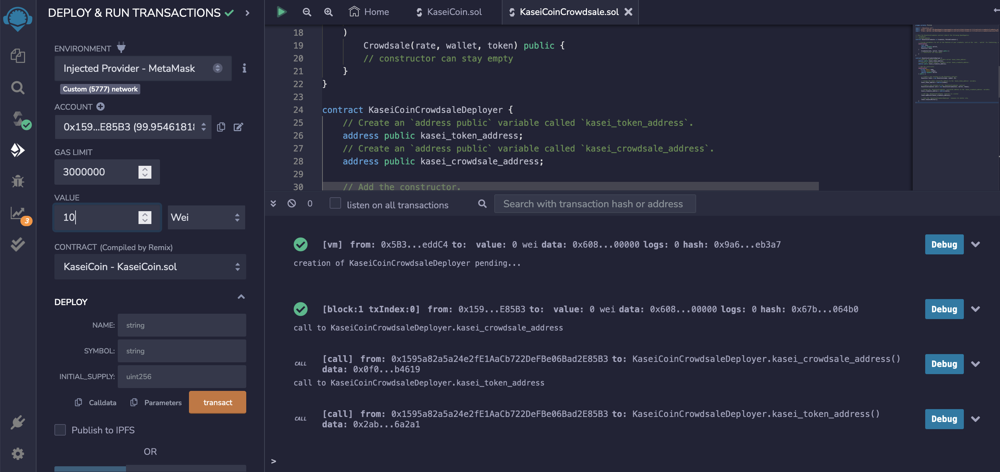

# *Token Crowdsale*
---

**Welcome to my repository for the Martian Token Crowdsale. Please explore the codebase!**  

>“Don’t stay in bed, unless you can make money in bed.” – George Burns
---
## Analytical Summary

This project creates a fungible token that is ERC-20 compliant and that is minted by using a crowdsale contract from the OpenZeppelin Solidity Library. The crowdsale contract manages the entire crowdsale process, allowing users to send ether to the contract and in return receive KAI, or KaseiCoin tokens. The contract mints the tokens automatically and distributes them to buyers in one transaction.

---

## Technologies

This project leverages Solidity compiler 0.5.0 that is run in the Remix IDE https://remix.ethereum.org

---

## Usage

To use this project run the code in Remix, using the compiler 0.5.0. Deploy the crowdsale to a local blockchain using Remix, MetaMask and Ganache.

---
## Methodology

Upload the KaseiCoin.sol file into the Remix. 
Compile the smart contract:

Upload the KaseiCoinCrowdsale.sol file into the Remix.
(Compiling the first part of the contract - not necessary)

Compile the smart contract:

Select Injected Provider as your Environment and deploy the KaseiCoinCrowdsaleDeployer contract. Select one of your MetaMask accounts (here account 4) as your wallet.

You will loose some of your Ethereum currency on gas fees, you can see it on your MetaMask account:

And also on your Ganache blockchain:

Select your KaseiCoinCrowdsale contract then enter your crowdsale address from your KaseiCoinCrowdsaleDeployer contract and insert it in the field next to 'At Address', then click 'At Address'.

Select your KaseiCoin contract then enter your token address from your KaseiCoinCrowdsaleDeployer contract and insert it in the field next to 'At Address', then click 'At Address'.

To purchase tokens add value in Weis at the top of the Remix site (I put 10 Wei):

Then in the KaseiCoinCrowdsale contract add beneficiary - one of your MetaMask acdress and click BuyTokens:

You can see on your MetaMask account that you get charged some gas fee for this transaction.

You can see the value of your new tokens on Ganache:

To purchase tokens for your second account add value in Weis at the top of the Remix site (I put 13 Wei):

You can see on your MetaMask account that you get charged some gas fee for this transaction.

You can see the value of your new tokens on Ganache:

You can also confirm the value of the Tokens by clicking on the balanceOf button in your contract:

You can approve both of these MetaMask accounts in the contract (it again cost you some ETH in gas fees):

And increase allowance for both of them (you will loose money in ETH in gas fees):

You can also transfer money in the newly issued Tokens from one account to another:

and see the altered balance after such transaction in both accounts:

You can keep track of your actions for your accounts in ETH in Ganache.

---

## Contributors

Brought to you by Katerina Gawthorpe.

---

## License

MIT